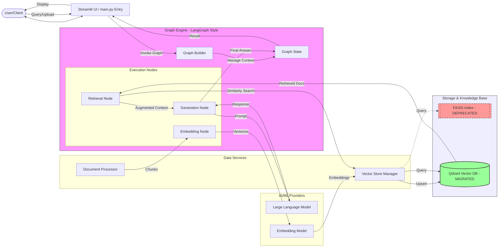

```mermaid
graph LR
    %% User Interaction Layer
    User([User/Client]) <--> UI[Streamlit UI / main.py Entry]

    %% Orchestration Layer (Modular Engine)
    subgraph Modular_Engine [Graph Engine - LangGraph Style]
        GB[Graph Builder]
        GS[Graph State]
        
        subgraph Nodes [Execution Nodes]
            RN[Retrieval Node]
            GN[Generation Node]
            EN[Embedding Node]
        end
    end

    %% Service Layer
    subgraph Data_Services [Data Services]
        DI[Document Processor]
        VM[Vector Store Manager]
    end

    %% Storage & External Providers
    subgraph Storage_Layer [Storage & Knowledge Base]
        direction LR
        FAISS[[FAISS Index - DEPRECATED]]
        QDRANT[(Qdrant Vector DB - MIGRATED)]
    end

    subgraph External_APIs [AI/ML Providers]
        LLM[Large Language Model]
        EMB[Embedding Model]
    end

    %% Data Flows
    User -->|Query/Upload| UI
    UI -->|Invoke Graph| GB
    GB -->|Manage Context| GS
    
    %% Ingestion Pipeline
    DI -->|Chunks| EN
    EN -->|Vectorize| EMB
    EMB -->|Embeddings| VM
    VM -->|Upsert| QDRANT
    
    %% RAG Retrieval Flow
    RN -->|Similarity Search| VM
    VM -.->|Query| FAISS
    VM -->|Query| QDRANT
    QDRANT -->|Retrieved Docs| RN
    
    %% Generation Flow
    RN -->|Augmented Context| GN
    GN -->|Prompt| LLM
    LLM -->|Response| GN
    GN -->|Final Answer| GS
    GS -->|Result| UI
    UI -->|Display| User

  %% Styling
    style FAISS fill:#f99,stroke:#333,stroke-dasharray: 5 5
    style QDRANT fill:#9f9,stroke:#333,stroke-width:2px
    style Modular_Engine fill:#f9f,stroke:#333
    style Storage_Layer fill:#eef,stroke:#333
```