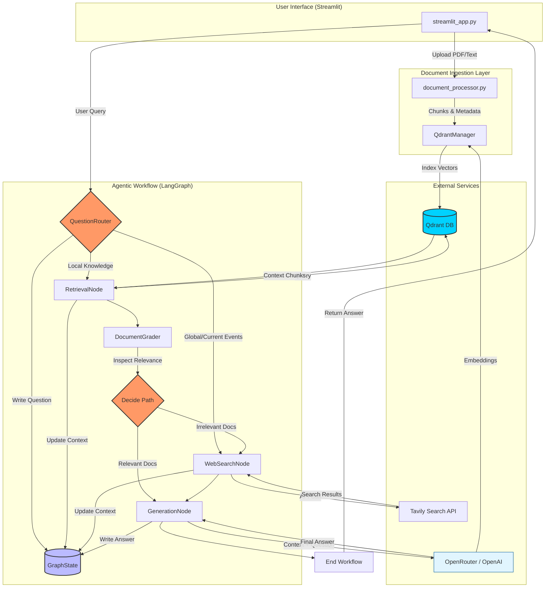

# DocRAGSearch Project Architecture

```mermaid
graph TD
    subgraph UI ["User Interface (Streamlit)"]
        A[streamlit_app.py]
    end

    subgraph Ingestion ["Document Ingestion Layer"]
        B[document_processor.py]
        C[QdrantManager]
    end

    subgraph Orchestration ["Agentic Workflow (LangGraph)"]
        direction TB
        State[(GraphState)]
        
        Router{QuestionRouter}
        Retrieve[RetrievalNode]
        Grader[DocumentGrader]
        WebSearch[WebSearchNode]
        Generate[GenerationNode]
        
        Decision{Decide Path}
    end

    subgraph External ["External Services"]
        Qdrant[(Qdrant DB)]
        LLM[OpenRouter / OpenAI]
        Tavily[Tavily Search API]
    end

    %% Data Ingestion Flow
    A -- Upload PDF/Text --> B
    B -- Chunks & Metadata --> C
    C -- Index Vectors --> Qdrant
    LLM -- Embeddings --> C

    %% Query Flow
    A -- User Query --> Router
    Router -- Write Question --> State

    %% Routing Decision
    Router -- "Local Knowledge" --> Retrieve
    Router -- "Global/Current Events" --> WebSearch

    %% Retrieval Path
    Retrieve -- Query --> Qdrant
    Qdrant -- Context Chunks --> Retrieve
    Retrieve -- Update Context --> State
    Retrieve --> Grader
    
    Grader -- Inspect Relevance --> Decision
    Decision -- "Irrelevant Docs" --> WebSearch
    Decision -- "Relevant Docs" --> Generate

    %% Web Search Path
    WebSearch -- API Call --> Tavily
    Tavily -- Search Results --> WebSearch
    WebSearch -- Update Context --> State
    WebSearch --> Generate

    %% Generation Path
    Generate -- "Context + Question" --> LLM
    LLM -- Final Answer --> Generate
    Generate -- Write Answer --> State
    Generate --> END[End Workflow]

    %% Result back to UI
    END -- Return Answer --> A

    %% Styling
    style Router fill:#f96,stroke:#333,stroke-width:2px
    style Decision fill:#f96,stroke:#333,stroke-width:2px
    style State fill:#bbf,stroke:#333,stroke-width:2px
    style Qdrant fill:#00d2ff,stroke:#333,stroke-width:2px
    style LLM fill:#e1f5fe,stroke:#01579b
```
